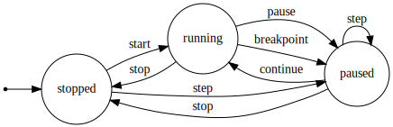

# Acceptance tests!

## Feature list

These are sorted in order of priority.

 - [ ] Pause execution
    - [ ] while Waterbear is running a continuous task (e.g., updating
          the canvas)
 * [ ] Single-step through blocks
    - [ ] Before execution has started
    - [ ] When execution is paused.
 * [ ] Set a breakpoint on a selected step blocks
 * [ ] Pause/step across asynchronous calls -- though this isn't a thing the user should care about
 - [ ] Pause on breakpoints
 * [ ] Resume execution once paused
 * [ ] Slow down script running if some input is active (e.g,. <kbd>shift</kbd> depressed)
 * [ ] Dynamically add elements when "paused"
 * [ ] Show the value variables as you step (like a table)
 * [ ] Show how many times a line gets called
 * [ ] [Extra credit] Add a console (similar to the box in Xcode playgrounds)

## User stories

As a user, I want to see how my program affected the state of the screen
and variables when I stop my application.

[VAGUE] As a user, I want to debug my program.

As a user, I want to step through each block invocation in my program.

As a user, I want to see the current value of variables as I step
through my program.

# The actual gorram tests

<a id="at1"/>
## Requirement 1: Pause Execution

### Setup

Load a script with at least one _continuously_ running, non-blocking step.

[Example Script][AT-1A]

### Test

 1. Start the execution of the script.
 2. Give the input for `pause script` (e.g., tapping the pause button).

### Acceptance Criteria

 1. There is _at least_ visual indication (if not more than visual) that
    execution has _paused_. This indication is distinct from that that
    is stopped.
 2. The step/context block that will be executed _next_ will be
    **directly** indicated, e.g., it would be highlighted, or annotated
    with a clearly visible icon.
 3. The option to pause the script will be disabled.

Notes: If there is only one block in the looping context, as there is in
[AT-1A][], then this block is the only possible block that can execution
can be paused at.

[AT-1A]: http://waterbearlang.com/playground.html?gist=27192efe96985464c5c3

<a id="at2a"/>
## Requirement 2a: Single-step through blocks (execution stopped)

### Setup

Load a script with at least one step block. Unlike [1](#at1), this step
block does not have to be a continuously looping context. Regardless,
the same script suffices for this test.

[Example Script][AT-1A]

### Preconditions

Execution is *stopped*.

### Test

 1. Give the input to step to the next block of the script (e.g., tap
    the step button).

### Acceptance Criteria

 1. Execution is started and is immediately paused on the _first_ step
    block -- whatever that may be. In the case of this test input, it is
    the first block in the drawing context.
 2. Indicators as in [1](#at1), using the first block in the script.

## Requirement 2b: Single-step through blocks (execution paused)

Load a script with at least two step block.

**TODO: Add a script here!**

### Preconditions

Execution is *stopped*.

### Test

 1. As in [2b](#at2b), single-step to the first block.
 2. Give the input to step to the next block of the script (e.g., tap
    the step button).

### Acceptance Criterai

 1. Execution is paused on the _second_ block.
 2. Indicators as in [1](#at1), use the second block in the script.

# Glossary

<dl>
<dt>paused</dt>
<dd>
Execution state wherein execution is suspended, but overall interpreter
state is defined. In laymen terms, stuff is running... but we just
frozen it for a moment to inspect what's going on.
</dd>

<dt>stopped<dt>
<dd>
Execution state that wherein execution is not defined! The only way out
is to start running. Stepping from the stopped state
<em>conceptually</em> starts the script and immediately pauses it.
</dd>

</dl>

